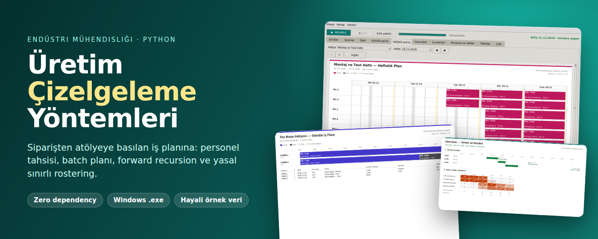
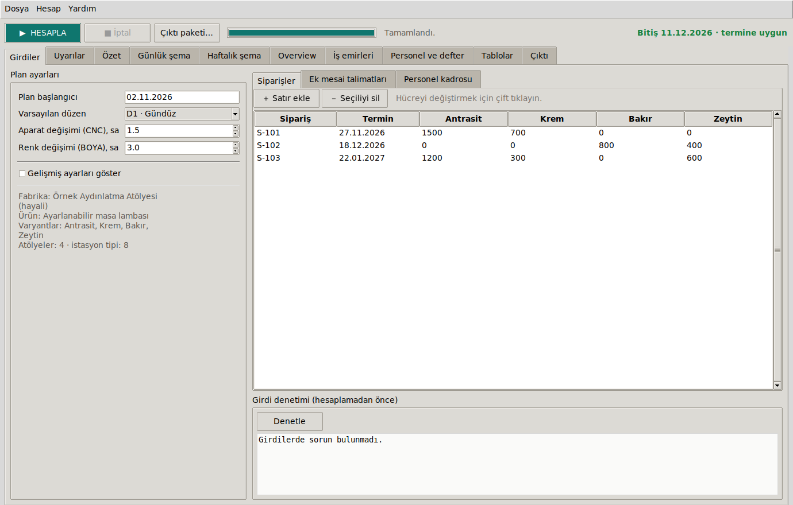
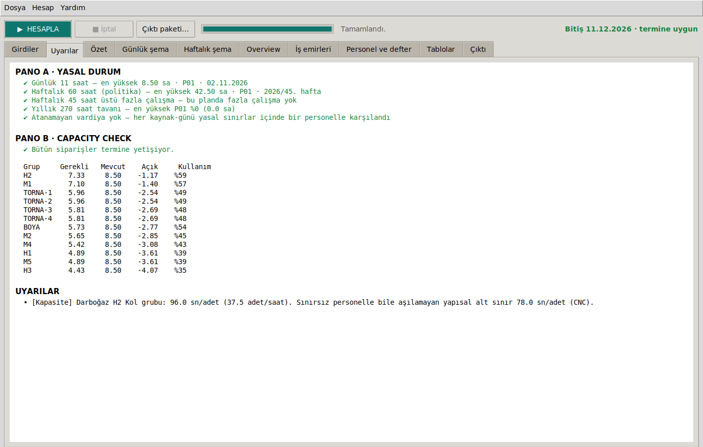
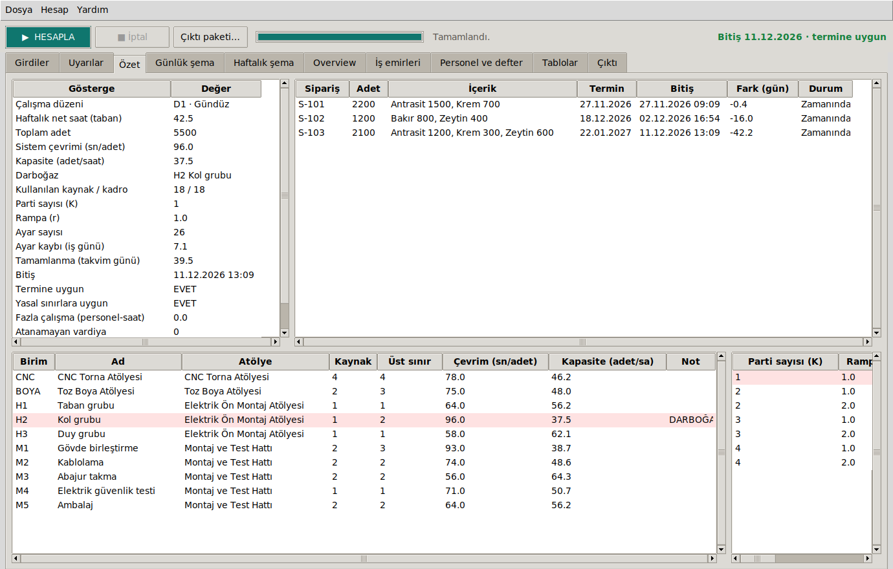
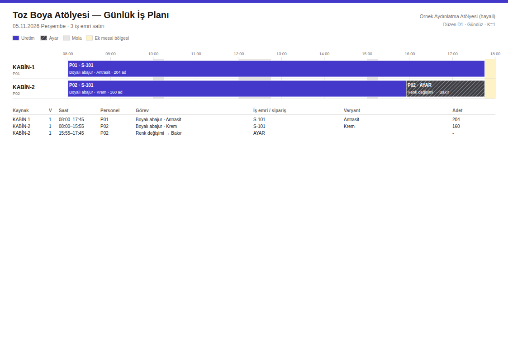
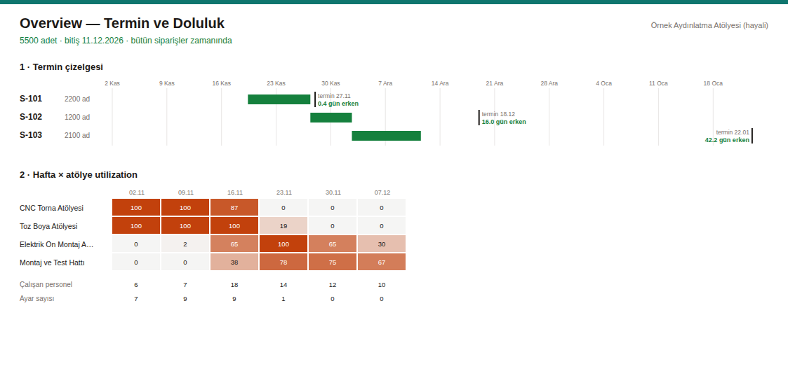
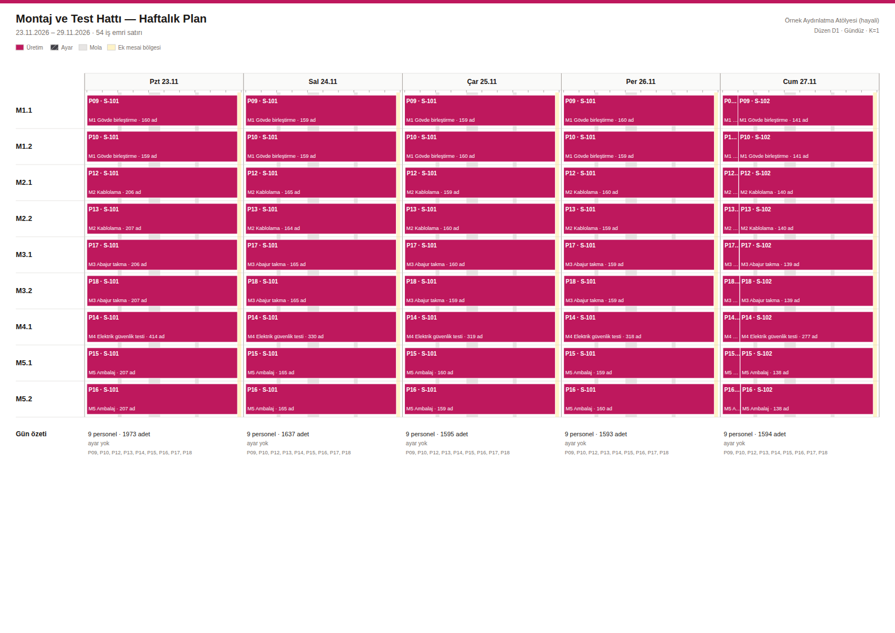

<p align="center">
  
</p>

<p align="center">
  <b>Siparişi gir, termin ve yasal limitlere uyan atölye planını al.</b><br>
  Endüstri mühendisliği yöntemleriyle çalışan, sıfır dış bağımlılıklı bir çizelgeleme ve personel tahsis yazılımı.
</p>

<p align="center">
  <a href="https://github.com/Omrndr/Uretim-Cizelgeleme-Yontemleri/releases/latest"></a>
  <a href="https://github.com/Omrndr/Uretim-Cizelgeleme-Yontemleri/actions/workflows/derle.yml"></a>
  
  
  
  <a href="LICENSE"></a>
</p>

<p align="center">
  <a href="#nasıl-çalışır"><b>Nasıl çalışır</b></a> ·
  <a href="#yöntemler"><b>Yöntemler</b></a> ·
  <a href="#özellikler"><b>Özellikler</b></a> ·
  <a href="#kurulum"><b>Kurulum</b></a> ·
  <a href="belgeler/MATEMATIK.md"><b>Matematik</b></a> ·
  <a href="belgeler/ALGORITMA.md"><b>Algoritma</b></a>
</p>

---

Çok siparişli, çok varyantlı bir üretimde "kim, hangi makinede, saat kaçta, hangi iş için çalışacak?" sorusunu elle
çözmek yavaş ve hataya açık: darboğaz kayıyor, setup'lar patlıyor, fazla çalışma limitleri unutuluyor.
**Bu proje bunu yöntemleriyle çözer**: siparişleri alır, kaynakları optimal dağıtır, planı hesaplar ve
atölyeye basılıp verilebilecek günlük/haftalık çizelgelere çevirir.

> **Örnek veriler tamamen hayalidir.** `veri/ornek_fabrika.json` içindeki atölye, ürün, süre ve kaynak adetleri
> yöntemleri göstermek için uydurulmuştur; gerçek bir işletmeye ait değildir. Motor geneldir: başka bir fabrika
> yalnızca yeni bir JSON tanımıyla modellenir.

<table>
  <tr>
    <td align="center" width="33%"><h3>🎯 Kanıtlı optimum</h3>Personel tahsisi kesin min-maks çözüm. Testler her kadro büyüklüğünde brute force ile birebir eşitliği doğrular.</td>
    <td align="center" width="33%"><h3>⚖️ Yasal sınırlarla</h3>Günlük 11 saat, haftalık limit ve yıllık 270 saat fazla çalışma her personel için ayrı ayrı denetlenir.</td>
    <td align="center" width="33%"><h3>🖨️ Sahaya hazır</h3>Zaman · kaynak · personel · iş emri satırlarından A4 günlük ve A3 haftalık planlar, PDF paketi.</td>
  </tr>
</table>

## Nasıl çalışır

### 1 · Girdileri gir

Siparişleri (varyant bazlı miktar ve termin), ek mesai talimatlarını ve personel kadrosunu tablolara yaz.
**HESAPLA**'ya (F5) bas; hesap arka planda koşar, pencere donmaz ve istediğin an iptal edebilirsin.

<p align="center">
  
</p>

### 2 · Uyarıları oku

Araç planı kendiliğinden değiştirmez, durumu ölçüp söyler. **Pano A** yasal limitleri, **Pano B** hangi hattın
yetmediğini ve günde kaç saat açık verdiğini gösterir. Termin tutmuyorsa kritik hat ve capacity check hemen orada.

<p align="center">
  
</p>

### 3 · Planı incele

Özet sekmesinde personel tahsisi, darboğaz ve parti araması tablosu var; seçilen plan vurgulanır. Overview sekmesi
termin çizelgesini ve hafta × atölye utilization heatmap'ini verir.

<p align="center">
  
</p>

### 4 · Atölye planlarına bak

Her atölye için günlük (A4) ve haftalık (A3) plan; her çubukta personel, iş emri, adet ve setup görünür. Ekranda
gördüğün şemayla kâğıda basılan birebir aynıdır.

<p align="center">
  
  
</p>

### 5 · Çıktı paketini al

Tek tuşla klasör yapılı paket: overview, her hafta ve atölye için haftalık + günlük planlar, personel kartları,
plan raporu, 15 sayfalık XLSX ve iş emirleri CSV'si. PDF için bilgisayardaki Edge/Chrome kullanılır; bulunamazsa
HTML bırakılır.

<p align="center">
  
</p>

## Yöntemler

| Problem | Yöntem | Özet |
|---|---|---|
| Personel tahsisi | Min-maks tam sayılı model, **candidate cycle sweep** | $\min_w \max_u \tau_u / w_u$, $\sum w_u \le N$ — brute force ile eşitliği testle kanıtlı |
| Paralel makine dengeleme | **P‖Cmax**: LPT + local search | $C_{LPT} \le (\tfrac43 - \tfrac1{3m})\,C^*$ (Graham) |
| Darboğaz analizi | Çevrim süresi, yapısal alt sınır | $C = \max_u f_u(w_u)$, kapasite $= 3600/C$ |
| Takvim | Birikimli çalışma fonksiyonu ve tersi | $\text{ilerlet}(t,d) = g^{-1}(g(t)+d)$, ikili arama |
| Parti / kampanya | Geometrik rampa, Hamilton yuvarlama, snake sequencing | $q_j \propto r^j$; parti geçişinde $K-1$ setup kazancı |
| Takım kısıtlı varyant | Fluid relaxation + D'Hondt, event-driven simülasyon | $q_{min} = \lceil S(1-\alpha)/(\alpha\tau) \rceil$ |
| Üretim sırası | **EDD** + **heijunka** (goal chasing) | $v_k = \arg\max_v (d_v k/D - x_v)$ |
| Akış hesabı | Forward recursion + list scheduling | $S_j(i) = \max(R_j(i), F_j(i-c_j))$ |
| Amaç | Leksikografik: termin → setup → makespan | $(K, r)$ ızgarası |
| Personel çizelgeleme | Yasal sınırlı rostering, greedy heuristic | marjinal fazla çalışma: $\max(0,H+h-45)-\max(0,H-45)$ |
| Ek mesai önerisi | Bottleneck walk | $\kappa_g = (c_g H + s_g E)\,3600/\tau_g$ |
| Capacity check | Analitik günlük açık | $h = N\tau / (c \cdot 3600 \cdot D)$ |

Formüllerin türetimi ve referanslar: **[belgeler/MATEMATIK.md](belgeler/MATEMATIK.md)** ·
Mimari, pseudocode'lar ve karmaşıklık: **[belgeler/ALGORITMA.md](belgeler/ALGORITMA.md)**

## Özellikler

| | |
|---|---|
| **Kesin tahsis** | Kadro kaç kişi olursa olsun darboğazı en aza indiren dağılım; artan personel akıllıca değerlendirilir. |
| **Kaynak bazlı takvim** | Ek mesai tek bir makineye ya da istasyona verilebilir; vardiya, mola ve zorunlu mola hesaba katılır. |
| **Batch ve setup dengesi** | $(K, r)$ taramasıyla termin ile setup sayısı arasındaki trade-off otomatik çözülür. |
| **Takım kısıtlı varyantlar** | Varyant başına sınırlı takım (ör. renk tabancası seti) ile paralel makine planı. |
| **Yasal rostering** | 11 saat / haftalık limit / 270 saat tavanı; aşan günler ayrı personelli vardiyalara bölünür. |
| **Fazla çalışma defteri** | Yıllık bakiyeler SQLite'ta tutulur; ad değişikliğinde bakiye taşıma var. |
| **Karar desteği** | Yasal durum ve capacity check panoları, bottleneck walk ile ek mesai önerisi, düzen karşılaştırması. |
| **Saha belgeleri** | A4 günlük, A3 haftalık, personel kartı, overview, XLSX (15 sayfa), CSV, PDF paketi. |
| **Genel motor** | Fabrika, ürün ağacı, takvim ve mevzuat tamamen JSON'dan okunur. |
| **Zero dependency** | Motor, arayüz, XLSX yazıcı ve çizimler yalnızca Python standart kütüphanesiyle çalışır. |

## Kurulum

**Windows:** [son sürümden](https://github.com/Omrndr/Uretim-Cizelgeleme-Yontemleri/releases/latest)
`UretimCizelgeleme.exe` dosyasını indirip çalıştır. Kurulum, yönetici izni ya da Python gerekmez (~15 MB).

<details>
<summary><b>Python ile çalıştır</b> (3.10+, ek paket yok)</summary>

```bash
python baslat.py                      # masaüstü arayüzü
python -m motor                       # komut satırı: örnek senaryo → rapor
python -m motor --paket Ciktilar      # + yazıcıya hazır PDF paketi
python -m unittest discover -s testler
```

Linux'ta Tkinter ayrı pakettir: `sudo apt install python3-tk`.

</details>

<details>
<summary><b>Kendi .exe dosyanı üret</b></summary>

```bash
pip install pyinstaller
python paketle.py            # → dist/UretimCizelgeleme.exe
```

GitHub Actions iş akışı (`.github/workflows/derle.yml`) testleri Linux ve Windows'ta koşar; `v*` etiketi atılınca
.exe'yi derleyip sürüme ekler.

</details>

<details>
<summary><b>Proje yapısı</b></summary>

```
motor/                 Hesap çekirdeği — yalnız standart kütüphane
  model.py               fabrika tanımı, sipariş, ek mesai, senaryo (JSON)
  tahsis.py              kesin min-maks personel tahsisi, kaynak listesi
  dengeleme.py           P||Cmax: LPT + local search
  takvim.py              vardiya, mola, zorunlu mola, g / g⁻¹ dönüşümü
  parti.py               parti büyüklükleri, snake sequencing, parça zamanları
  varyant.py             takım kısıtlı varyant planı (event-driven)
  siralama.py            EDD + goal chasing
  akis.py                forward recursion, list scheduling, constraint analizi
  personel.py            yasal sınırlı personel ataması
  defter.py              yıllık fazla çalışma defteri (SQLite)
  cozucu.py              end-to-end planlayıcı, ek mesai önerisi
  analiz.py · uyarilar.py · dogrulama.py
rapor/                 Çıktı katmanı
  is_emirleri.py         vardiya dilimleme, adet ve sipariş atfı
  cizim.py               tek sahne → SVG / HTML (ve Tk Canvas)
  semalar.py             günlük A4 / haftalık A3 planlar
  genel_bakis.py         termin çizelgesi + hafta × atölye heatmap
  tablolar.py            CSV ve bağımlılıksız XLSX yazıcı
  paket.py               klasör yapılı PDF paketi (headless tarayıcı)
arayuz/                Tkinter masaüstü uygulaması
veri/                  Hayali örnek fabrika ve senaryo
testler/               24 test — brute force doğrulamaları dahil
```

</details>

Ayrıntılı kullanım, senaryo dosyası biçimi ve kendi fabrikanı tanımlama: [belgeler/KULLANIM.md](belgeler/KULLANIM.md)

## Good to know

- **Ekran = kâğıt.** Şemalar araçtan bağımsız bir sahneye çizilir; aynı sahne SVG'ye (baskı) ve Tk Canvas'a (ekran) dönüşür.
- **Ölç, öner, dayatma.** Ek mesai yalnızca senin talimatınla eklenir; motor açığı ölçer ve hangi kaynakların uzatılacağını önerir.
- **Her kaynağın kendi takvimi var.** Algoritmaların geri kalanı bunu `ilerlet(t, d)` soyutlaması üzerinden görür.
- **Yasal hesapları kontrol et.** Mevzuat sınırları (4857 s. İş Kanunu m.41 ve m.63) bilgilendirme amaçlı modellenmiştir; gerçek bir işletmede kullanmadan önce iş hukuku danışmanına doğrulat.

## Disclaimer

Bu bağımsız bir portfolyo projesidir. Örnek fabrika, ürün, süre ve sipariş verilerinin tamamı hayalidir; herhangi bir
gerçek kişi ya da kuruluşla ilgisi yoktur.

## License

[CC BY-NC 4.0](LICENSE) © 2026 Koray Akdoğan — atıf vererek paylaşabilir ve uyarlayabilirsin; **ticari kullanım yasaktır**.

---

<p align="center">
  <br>
  <sub>Formüller ve referanslar: <a href="belgeler/MATEMATIK.md">MATEMATIK.md</a> ·
  mimari ve pseudocode'lar: <a href="belgeler/ALGORITMA.md">ALGORITMA.md</a> ·
  kullanım: <a href="belgeler/KULLANIM.md">KULLANIM.md</a></sub>
</p>
