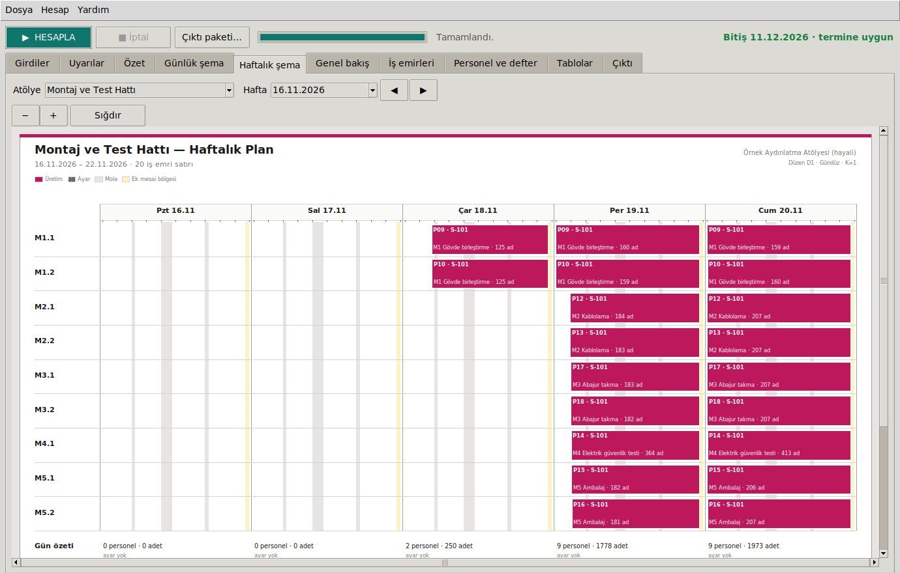

# Üretim Çizelgeleme Yöntemleri

[](https://github.com/Omrndr/Uretim-Cizelgeme-Yontemleri/actions/workflows/derle.yml)

Endüstri mühendisliği ve yöneylem araştırması yöntemleriyle çalışan uçtan uca bir
**üretim çizelgeleme ve personel tahsis** yazılımı. Siparişlerden başlar ve
atölyeye basılıp dağıtılabilecek saat ölçekli iş planlarıyla biter.

> **Örnek veriler tamamen hayalidir.** `veri/ornek_fabrika.json` içindeki atölye,
> ürün, süreler ve kaynak adetleri yöntemleri göstermek için uydurulmuştur;
> gerçek bir işletmeye ait değildir. Motor geneldir: başka bir fabrika yalnızca
> yeni bir JSON tanımıyla modellenebilir.

<p align="center">
  
</p>

## Yazılımın yaptıkları

1. **Kapasite ve darboğaz:** Personeli birimlere kesin optimal biçimde dağıtır ve sistem çevrim süresini ve darboğazı bulur.
2. **Çizelge:** Paralel makinelerin yükünü dengeler, ayar (aparat ya da renk değişimi) ile termin arasındaki ödünleşimi parti planıyla çözer ve her ürünün her istasyondaki başlangıç/bitiş anını kaynak takvimleri üzerinden hesaplar.
3. **Personel:** Her makine ve istasyon gününe bir kişi atar. Günlük 11 saat, haftalık sınır ve yıllık 270 saat fazla çalışma tavanı (4857 s. İş Kanunu) her kişi için ayrı ayrı denetlenir; yıllık bakiyeler kalıcı bir defterde tutulur.
4. **Karar desteği:** Kapasite kararı planlamacıda kalır. Yasal durum ve hat yeterliliği panoları sorunu ve günlük açığı ölçer; ek mesai için darboğaz takibiyle öneri üretir.
5. **Saha belgeleri:** Zaman · kaynak · personel · iş emri satırlarından günlük A4 ve haftalık A3 planlar, personel kartları, PDF paketi, 15 sayfalık XLSX ve CSV üretir.

## Kullanılan yöntemler

| Problem | Yöntem | Özet |
|---|---|---|
| Personel tahsisi | Min-maks tam sayılı model, **aday çevrim taraması** | $\min_w \max_u \tau_u / w_u$, $\sum w_u \le N$ — kaba kuvvetle eşitliği testlerle kanıtlı |
| Paralel makine dengeleme | **P‖Cmax**: LPT + en dik iniş yerel arama | $C_{LPT} \le (\tfrac43 - \tfrac1{3m})\,C^*$ (Graham) |
| Darboğaz analizi | Çevrim süresi, yapısal alt sınır | $C = \max_u f_u(w_u)$, kapasite $= 3600/C$ |
| Takvim | Birikimli çalışma fonksiyonu ve tersi | $\text{ilerlet}(t,d) = g^{-1}(g(t)+d)$, ikili arama |
| Parti / kampanya | Geometrik rampa, Hamilton yuvarlama, yılan sıra | $q_j \propto r^j$; parti geçişinde $K-1$ ayar kazancı |
| Takım kısıtlı varyant | Akışkan gevşetme + D'Hondt, olay güdümlü benzetim | $q_{min} = \lceil S(1-\alpha)/(\alpha\tau) \rceil$ |
| Üretim sırası | **EDD** + **heijunka** (hedef kovalama) | $v_k = \arg\max_v (d_v k/D - x_v)$ |
| Akış hesabı | İleri özyineleme + liste çizelgeleme | $S_j(i) = \max(R_j(i), F_j(i-c_j))$ |
| Amaç | Leksikografik: termin → ayar → tamamlanma | $(K, r)$ ızgarası |
| Personel çizelgeleme | Yasal sınırlı rostering, açgözlü sezgisel | marjinal fazla çalışma: $\max(0,H+h-45)-\max(0,H-45)$ |
| Ek mesai önerisi | Darboğaz takibi | $\kappa_g = (c_g H + s_g E)\,3600/\tau_g$ |
| Hat yeterliliği | Analitik günlük açık | $h = N\tau / (c \cdot 3600 \cdot D)$ |

Formüllerin türetimi ve gerekçeleri: **[belgeler/MATEMATIK.md](belgeler/MATEMATIK.md)**
Mimari, sözde kodlar ve karmaşıklık: **[belgeler/ALGORITMA.md](belgeler/ALGORITMA.md)**

## Görseller

| Günlük atölye planı (A4) | Genel bakış |
|---|---|
|  |  |
| **Özet: tahsis ve parti araması** | **Uyarı panoları** |
|  |  |

## Hızlı başlangıç

**Windows:** [Releases](https://github.com/Omrndr/Uretim-Cizelgeme-Yontemleri/releases)
sayfasından `UretimCizelgeleme.exe` dosyasını indirip çalıştırın. Kurulum ya da
Python gerekmez.

**Python 3.10+** (ek paket gerekmez):

```bash
python baslat.py                      # masaüstü arayüzü
python -m motor                       # komut satırı: örnek senaryo → rapor
python -m motor --paket Ciktilar      # + yazıcıya hazır PDF paketi
python -m unittest discover -s testler
```

Ayrıntılar: [belgeler/KULLANIM.md](belgeler/KULLANIM.md)

## Proje yapısı

```
motor/                 Hesap çekirdeği — yalnız standart kütüphane
  model.py               fabrika tanımı, sipariş, ek mesai, senaryo (JSON)
  tahsis.py              kesin min-maks personel tahsisi, kaynak listesi
  dengeleme.py           P||Cmax: LPT + yerel arama
  takvim.py              vardiya, mola, zorunlu mola, g / g⁻¹ dönüşümü
  parti.py               parti büyüklükleri, yılan sıra, parça zamanları
  varyant.py             takım kısıtlı varyant planı (olay güdümlü)
  siralama.py            EDD + hedef kovalama
  akis.py                ileri özyineleme, liste çizelgeleme, kısıt analizi
  personel.py            yasal sınırlı personel ataması
  defter.py              yıllık fazla çalışma defteri (SQLite)
  cozucu.py              uçtan uca planlayıcı, ek mesai önerisi
  analiz.py · uyarilar.py · dogrulama.py
rapor/                 Çıktı katmanı
  is_emirleri.py         vardiya dilimleme, adet ve sipariş atfı
  cizim.py               tek sahne → SVG / HTML (ve Tk Canvas)
  semalar.py             günlük A4 / haftalık A3 planlar
  genel_bakis.py         termin çizelgesi + hafta × atölye ısı haritası
  tablolar.py            CSV ve bağımlılıksız XLSX yazıcı
  paket.py               klasör yapılı PDF paketi (headless tarayıcı)
arayuz/                Tkinter masaüstü uygulaması (arka plan iş parçacığı, iptal)
veri/                  Hayali örnek fabrika ve senaryo
testler/               24 test — kaba kuvvet doğrulamaları dahil
paketle.py             PyInstaller ile tek dosyalık .exe
.github/workflows/     test (Linux + Windows) ve .exe derleme
```

## Lisans

[CC BY-NC 4.0](LICENSE): atıf yapmak koşuluyla paylaşabilir ve uyarlayabilirsiniz; **ticari kullanım yasaktır**. © 2026 Koray Akdoğan.

## Tasarım kararları

- **Sıfır dış bağımlılık.** Motor, arayüz, XLSX yazıcı ve çizimler yalnızca Python standart kütüphanesini kullanır. .exe yaklaşık 15 MB'tır.
- **Ekran = kâğıt.** Şemalar araçtan bağımsız bir sahneye çizilir. Aynı sahne SVG'ye (baskı) ve Tk Canvas'a (ekran) dönüştürülür.
- **Ölç, öner, dayatma.** Ek mesai yalnızca planlamacının talimatıyla eklenir; motor açığı analitik olarak ölçer ve hangi kaynakların uzatılacağını önerir.
- **Her kaynağın kendi takvimi var.** Ek mesai tek bir makineye verilebilir; algoritmaların geri kalanı bunu `ilerlet(t, d)` soyutlaması üzerinden görür.
