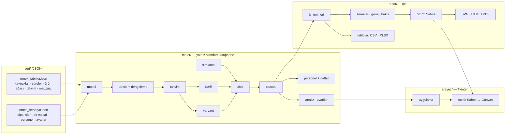
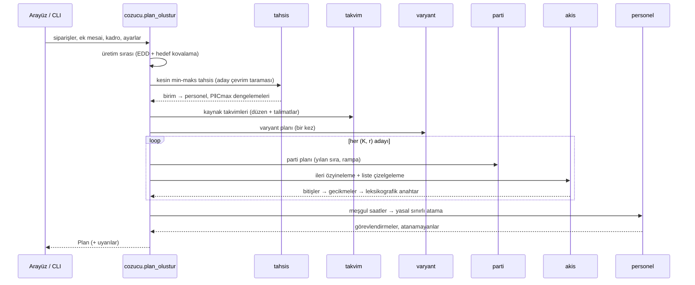
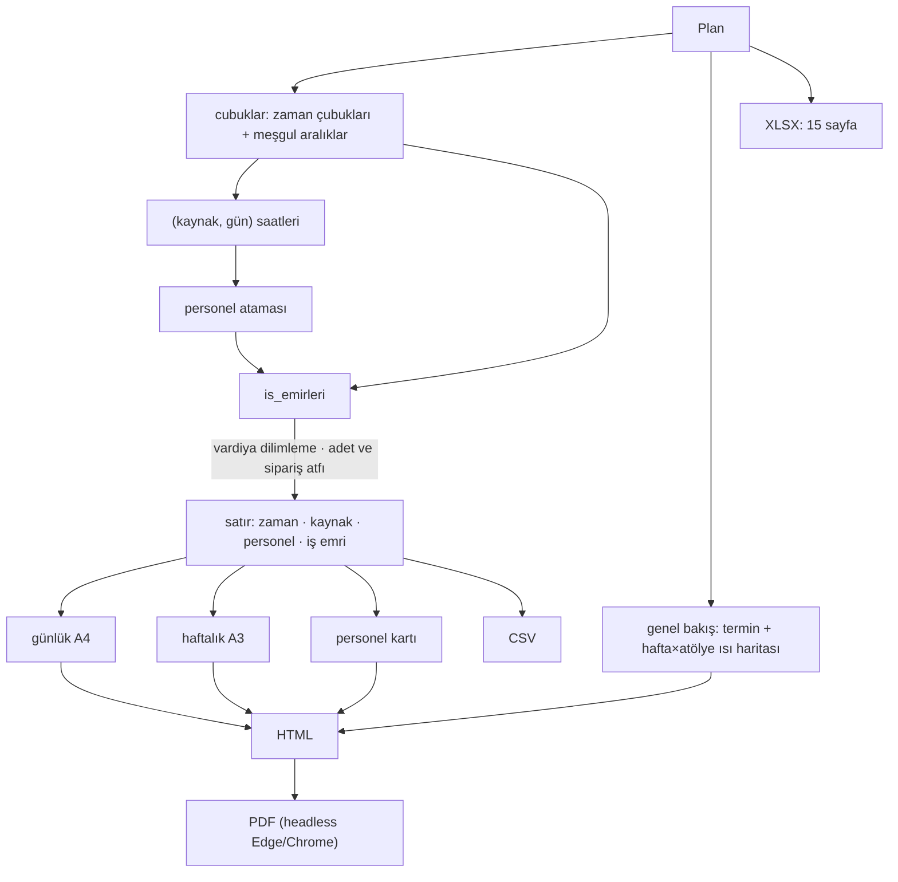

# Algoritmik Yapı ve Mimari

Bu belge kodun nasıl örgütlendiğini, verinin hangi sırayla aktığını ve her
algoritmanın sözde kodunu anlatır. Formüllerin gerekçeleri
[MATEMATIK.md](MATEMATIK.md) dosyasındadır.

## 1. Katmanlar



| Katman | Sorumluluk | Bağımlılık |
|---|---|---|
| `motor/` | Bütün hesap; arayüzden ve dosya biçimlerinden habersiz | stdlib |
| `rapor/` | İş emirleri, çizimler, PDF paketi, CSV/XLSX | `motor`, stdlib |
| `arayuz/` | Masaüstü pencere, iş parçacığı, tablolar | `motor`, `rapor`, tkinter |

Tek bir `Sahne` nesnesi hem yazdırılan SVG'yi hem ekrandaki Canvas'ı üretir.
Böylece ekranda görülen ile kâğıda basılan birebir aynıdır. Motor genel bir
yapıdadır: başka bir fabrika, yalnızca yeni bir JSON tanımıyla modellenebilir
(bkz. [KULLANIM.md § 5](KULLANIM.md#5-kendi-fabrikanızı-tanımlamak)).

## 2. Uçtan uca akış



## 3. Sözde kodlar

### 3.1 Planlayıcı

```text
plan_olustur(fabrika, siparişler, başlangıç, talimatlar, ayarlar, kadro):
    sıra    ← üretim_sırası(siparişler)                        # § 3.6
    tahsis  ← en_iyi_dagilim(fabrika, |kadro|, talep_varyantları)   # § 3.2
    kaynak  ← her birim u için w_u adet kaynak (TORNA-1, KABİN-2, M1.3 ...)
    takvim  ← FabrikaTakvimi(kaynaklar, varsayılan düzen, talimatlar)
    varyant ← varyant_planı(sıra, ...)                         # § 3.5 — K'dan bağımsız
    en_iyi  ← ∅
    for (K, r) in ızgara:
        parça_zamanları ← her makine grubu için parti_planı(K, r)   # § 3.4
        akış            ← akış_hesabı(sıra, parça_zamanları, varyant)  # § 3.7
        gecikme_o       ← (son bitiş_o − termin_anı_o) / 1 gün
        anahtar         ← (gecikme var mı, ayar sayısı | L_max, tamamlanma, ayar)
        en_iyi          ← lex-min(en_iyi, anahtar)
    saatler ← meşgul aralıklar ∩ takvim pencereleri  → (kaynak, gün) → saat
    atama   ← personel_ata(saatler, kadro, mevzuat, defter bakiyeleri)  # § 3.8
    return Plan(en_iyi, atama, uyarılar)
```

### 3.2 Kesin min-maks tahsis

```text
en_iyi_dagilim(birimler, N):
    if N < |birimler|: return YOK
    adaylar ← sırala({ f_u(k) : u, k = 1..ū_u })
    for c in adaylar:
        n_u ← min{ k : f_u(k) ≤ c }  her u için
        if Σ n_u ≤ N:  w ← n ;  break          # ilk uygun aday optimaldir
    artan ← N − Σ w
    while artan > 0:                            # artık personel
        aday ← { makine grubu u : w_u < ū_u ve f_u(w_u+1) ≤ f_u(w_u) }
        if aday = ∅: aday ← { u : w_u < ū_u }
        if aday = ∅: break
        w_argmax f_u(w_u) += 1 ;  artan −= 1
    return w
```

### 3.3 P‖Cmax: LPT + yerel arama

```text
dengele(t, m):
    yığın ← m adet (yük=0, makine)
    for p in sırala_azalan(t):  (yük, k) ← yığın.çek ; P_k ∪= {p} ; yığın.koy(yük + t_p, k)
    repeat:
        a ← argmax L
        hamle ← { taşı(p: a→b), takas(p∈a, q∈b) } içinde max(L_a', L_b') en küçük olan
        if hamle yok veya max(L_a', L_b') ≥ L_a: dur
        uygula(hamle)
```

### 3.4 Parti planı ve parça zamanları

```text
parti_planı(grup, K, r, S):
    q ← Hamilton( N · r^j / Σ r^l )
    for her makine k, parçaları P_k (uzun önce):
        t ← ilk_müsait(0) ; önceki ← ∅
        for j, q_j:
            sıra ← P_k  ya da (yılan sırada, j tekse) ters(P_k)
            for p in sıra:
                if p ≠ önceki: t ← ilerlet(t, S) ; ayar += 1
                baş ← ilk_müsait(t) ; t ← ilerlet(baş, q_j · t_p)
                parça_zamanları[p].ekle(baş, q_j, t_p, takvim_k)   # i. adet: ikili arama
                önceki ← p
```

### 3.5 Varyant planı (olay güdümlü)

```text
varyant_planı(sıra, m, T, S, τ):
    n ← akışkan paylar + D'Hondt (takım sınırlı)
    q_min ← ⌈S / τ⌉
    kuyruk ← makineler (müsait an)
    while kalan talep var:
        mk ← kuyruk.en_erken()
        boşta ← { v : kalan_v > 0 ve aktif_v < T_v }
        if mk.v'nin talebi bitti:          yeni ← argmin_{boşta} ihtiyaç_konumu
        elif mk.seri ≥ q_min:              yeni ← argmin { v ∈ boşta : aktif_v = 0
                                                            ve ihtiyaç_v < ihtiyaç_{mk.v} }
        if yeni: partiyi kapat ; mk.v ← yeni ; ayar gerekli ; kuyruğa geri koy ; devam
        gerekiyorsa ayar ; bir adet üret ; bitiş anını kaydet ; kuyruğa geri koy
    j. bitiş → v varyantlı j. ürün (sipariş atfı)
```

### 3.6 Üretim sırası

```text
üretim_sırası(siparişler):
    for o in sırala(siparişler, termin):              # EDD
        for k = 1..D_o:  v ← argmax_v ( d_v·k/D_o − x_v ) ; x_v += 1 ; ekle(o, v)
```

### 3.7 Akış hesabı

```text
for i = 1..N:
    for j in (hücreler, hat istasyonları):
        R ← max( önceki istasyonun F(i), parça P_p(i), hücre F_h(i), varyant V_v(κ_i) )
        s ← argmin_s ilerle_s( max(R, A_s), τ_j )    # liste çizelgeleme
        S_j(i) ← ilk_müsait_s(max(R, A_s)) ;  F_j(i) ← ilerle_s(S_j(i), τ_j) ;  A_s ← F_j(i)
        kısıt[j][neden] += 1 ;  aç kalma += g(R) − g(A_s)   (istasyon girdi bekliyorsa)
```

### 3.8 Personel ataması

```text
for g in günler (artan):
    for (k, h) in o günün kaynakları (h azalan):
        for vardiya in böl(h, 11):
            aday ← { e : bugün atanmamış,
                         günlük_e + v ≤ 11,  haftalık_e + v ≤ H_hafta,
                         yıllık_e + ΔFM_e + mola ≤ 270 }
            if aday = ∅: atanamayan'a ekle ; devam
            e ← lex-min( ΔFM>0 ?, dün k'de değil ?, haftalık_e, yıllık_e, sıra_e )
            kayıtları güncelle
```

## 4. Karmaşıklık

| Adım | Karmaşıklık | Örnek (5 500 adet) |
|---|---|---|
| Tahsis (aday taraması) | $O(\lvert\mathcal{A}\rvert \cdot \lvert U\rvert \cdot \bar w)$ | < 10 ms |
| P‖Cmax (LPT + yerel arama) | $O(n \log n)$ + $O(\text{adım} \cdot m \cdot n^2)$ | < 5 ms |
| Takvim kurulumu | $O(\lvert\text{kaynak}\rvert \cdot \text{ufuk})$, gün bloğu önbellekli | ~0,2 s |
| Varyant benzetimi | $O(N \log m)$ olay | ~0,1 s |
| Parti + akış (aday başına) | $O(N \cdot \sum_j c_j \cdot \log \lvert W\rvert)$ | ~0,2 s |
| Personel ataması | $O(\text{gün} \cdot \text{vardiya} \cdot \lvert E\rvert)$ | ~0,1 s |
| **Toplam (7 aday)** | | **≈ 2 s** |

## 5. Çıktı üretimi



**İş emri satırlarının üretimi.**

1. Her (kaynak, gün) için meşgul aralıklar takvim pencereleriyle kesiştirilir.
2. Bu zaman çizgisi, atamadaki vardiya saatleri kadar sırayla dilimlenir; 11 saati aşıp bölünen günlerde her vardiyanın gerçek saat aralığı böylece belirlenir.
3. Her zaman çubuğu her vardiya dilimiyle kesiştirilir.
4. Kesişen parçanın adedi hücre ve hatta kesin olarak (başlangıcı dilime düşen ürünler), makinelerde parti ilerlemesine göre çalışma süresi oranıyla bulunur.
5. Sipariş, partinin beslediği ürünlerin sıradaki konumundan türetilir.

## 6. Doğrulama

`testler/` altındaki 24 test her yöntemi bağımsız bir yolla doğrular:

| Test | Doğrulama |
|---|---|
| Tahsis | 10–22 kişilik bütün kadrolarda ve 60 rastgele örnekte **kaba kuvvet tam sayımıyla birebir aynı** (çevrim, personel) |
| Dengeleme | Kaba kuvvet optimumu ≥ alt sınır; LPT ≤ Graham sınırı; yerel arama kötüleştirmez |
| Takvim | $g(g^{-1}(w)) = w$; zorunlu mola; sabit molalar çalışılmaz |
| Parti / sıra | Toplam korunur; rampa monoton; hedef kovalamada oran sapması < 1 |
| Akış | Öncelik ilişkileri; istasyonda çakışma yok |
| Varyant | Üretilen = talep; hiçbir anda takım sınırı aşılmaz |
| Personel | Günlük/haftalık/yıllık sınırlar; kişi başına günde tek vardiya; saat korunumu |
| Uçtan uca | Termine uygunluk; iş emri adetleri = ürün × parça sayısı; paket, XLSX, senaryo ve defter gidiş-dönüşü |
